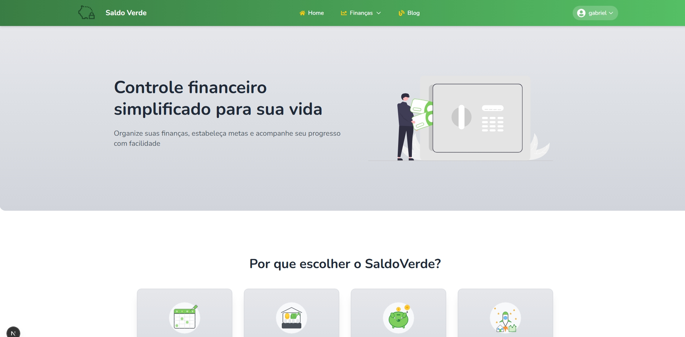
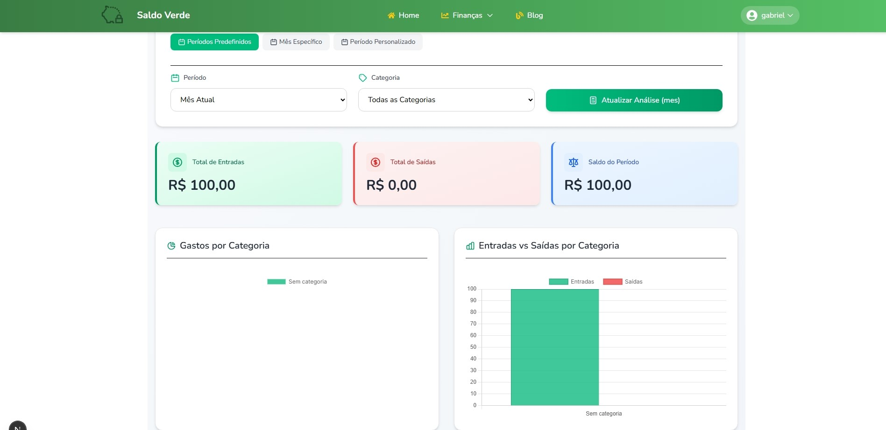
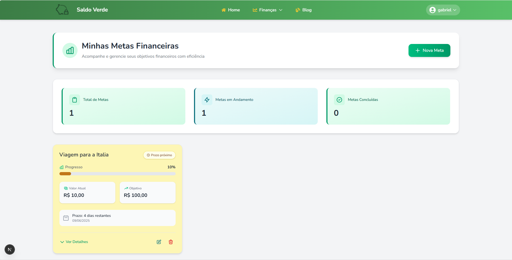

<div align="center">

#  SaldoVerde

### 💰 Controle financeiro simplificado para sua vida

[](https://opensource.org/licenses/MIT)
[](https://nextjs.org/)
[](https://nodejs.org/)
[](https://reactjs.org/)
[](https://tailwindcss.com/)

</div>

## 📋 Sobre o Projeto

O **SaldoVerde** é uma plataforma de finanças pessoais desenvolvida para facilitar o controle financeiro do usuário de forma simples, intuitiva e divertida. Nosso objetivo é ajudar as pessoas a organizarem suas finanças, estabelecerem metas e acompanharem seu progresso financeiro com facilidade.

### ✨ Principais Funcionalidades

- **Controle de Transações**: Registre receitas e despesas de forma organizada
- **Categorias Personalizadas**: Crie e gerencie categorias com cores e ícones personalizados
- **Metas Financeiras**: Estabeleça objetivos claros para suas economias e investimentos
- **Análises e Gráficos**: Visualize suas finanças com gráficos e relatórios detalhados
- **Planejamento Inteligente**: Organize seu orçamento mensal e planeje seus gastos

## 🖼️ Capturas de Tela

<div align="center">
<table>
  <tr>
    <td></td>
    <td></td>
  </tr>
  <tr>
    <td></td>
  </tr>
</table>
</div>

## 🚀 Começando

### Pré-requisitos

- [Node.js](https://nodejs.org/) (versão 18.x ou superior)
- [npm](https://www.npmjs.com/) (normalmente instalado com o Node.js)
- [Git](https://git-scm.com/) para clonar o repositório

### Instalação

1. Clone o repositório:
   ```bash
   git clone https://github.com/palmitex/projeto-financias.git
   cd projeto-financias
   ```

2. Instale as dependências do backend:
   ```bash
   cd API
   npm install
   ```

3. Configure o arquivo `.env` na pasta API com suas credenciais de banco de dados:
   ```
   DB_HOST=seu_host
   DB_USER=seu_usuario
   DB_PASSWORD=sua_senha
   DB_NAME=saldoverde
   JWT_SECRET=sua_chave_secreta
   ```

4. Instale as dependências do frontend:
   ```bash
   cd ../front
   npm install
   ```

5. Configure o arquivo `.env.local` na pasta front com a URL da API:
   ```
   NEXT_PUBLIC_API_URL=http://localhost:3001
   ```

### Executando o Projeto

Você precisará executar o backend e o frontend em terminais separados:

#### Backend (API)

```bash
cd API
node app.js
```
O servidor backend estará disponível em `http://localhost:3001`.

#### Frontend

```bash
cd front
npm run dev
```
O aplicativo frontend estará disponível em `http://localhost:3000`.

## 📦 Tecnologias Utilizadas

### Backend
- [Node.js](https://nodejs.org/) - Ambiente de execução JavaScript
- [Express](https://expressjs.com/) - Framework web para Node.js
- [PostgreSQL](https://postgresqlstudio.org/) - Sistema de gerenciamento de banco de dados

### Frontend
- [Next.js](https://nextjs.org/) - Framework React com renderização do lado do servidor
- [React](https://reactjs.org/) - Biblioteca JavaScript para construção de interfaces
- [Tailwind CSS](https://tailwindcss.com/) - Framework CSS utilitário
- [Flowbite](https://flowbite.com/) - Biblioteca de componentes para Tailwind CSS
- [Chart.js](https://www.chartjs.org/) - Biblioteca para criação de gráficos

## 🗂️ Estrutura do Projeto

```
.
└── projeto-financias/
    ├── API/                   # Backend da aplicação
    │   ├── config/           # Configurações (banco de dados, etc)
    │   ├── controllers/      # Controladores da API
    │   ├── models/           # Modelos de dados
    │   ├── routes/           # Rotas da API
    │   ├── .env              # Variáveis de ambiente (não versionado)
    │   └── app.js            # Ponto de entrada do backend
    │
    └── front/                # Frontend da aplicação
        ├── app/              # Páginas e componentes Next.js
        ├── components/       # Componentes React reutilizáveis
        ├── context/          # Contextos React (autenticação, etc)
        ├── data/             # Dados estáticos
        ├── public/           # Arquivos públicos (imagens, etc)
        └── .env.local        # Variáveis de ambiente (não versionado)
```


## 📃 Licença

Este projeto está licenciado sob a Licença MIT - veja o arquivo [LICENSE](LICENSE) para detalhes.

## 👥 Desenvolvedores

<table>
  <tr>
    <td align="center">
      <a href="https://github.com/vc-franca">
        <br>
        <sub><b>Victor Cestari</b></sub>
      </a>
    </td>
    <td align="center">
      <a href="https://github.com/ToledoP">
        <br>
        <sub><b>Lucas Toledo</b></sub>
      </a>
    </td>
    <td align="center">
      <a href="https://github.com/palmitex">
        <br>
        <sub><b>Gabriel Palmieri</b></sub>
      </a>
    </td>
  </tr>
</table>

---

<div align="center">
  <p>Desenvolvido com 💚 pelo time SaldoVerde</p>
</div>