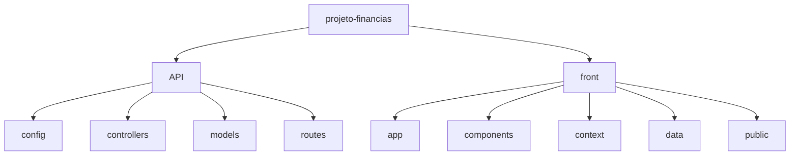

# <div align="center">💸 Saldo Verde</div>

<div align="center">

[](https://choosealicense.com/licenses/mit/)
[](https://github.com/palmitex/projeto-financias/stargazers)
[](https://github.com/palmitex/projeto-financias/issues)

<br/>

<p align="center">
  <a href="#-funcionalidades">Funcionalidades</a> •
  <a href="#-instalação">Instalação</a> •
  <a href="#%EF%B8%8F-stack-tecnológica">Stack</a> •
  <a href="#-contribuindo">Contribuir</a> •
  <a href="#-time">Time</a>
</p>

<br/>


</div>

---

## ✨ Funcionalidades

<table align="center">
  <tr>
    <td align="center">
      <br>
      <b>Dashboard<br>Intuitivo</b>
    </td>
    <td align="center">
      <br>
      <b>Metas<br>Financeiras</b>
    </td>
    <td align="center">
      <br>
      <b>Controle de<br>Gastos</b>
    </td>
    <td align="center">
      <br>
      <b>Design<br>Responsivo</b>
    </td>
  </tr>
  <tr>
    <td align="center">
      <br>
      <b>Dados<br>Seguros</b>
    </td>
    <td align="center">
      <br>
      <b>Blog<br>Educativo</b>
    </td>
    <td align="center">
      <br>
      <b>Gráficos<br>Interativos</b>
    </td>
    <td align="center">
      <br>
      <b>Backup<br>na Nuvem</b>
    </td>
  </tr>
</table>

## 🚀 Instalação

<details>
<summary>📋 Pré-requisitos</summary>

- Node.js 18.x ou superior
- NPM ou Yarn
- Git
</details>

<details>
<summary>⚙️ Configuração</summary>

1. **Clone o repositório**
```bash
git clone https://github.com/palmitex/projeto-financias
cd projeto-financias
```

2. **Configure as variáveis de ambiente**
```bash
# Na pasta API
cp .env.example .env
# Na pasta front
cp .env.example .env.local
```
</details>

<details>
<summary>🔧 Instalação</summary>

```bash
# Instale as dependências do backend
cd API && npm install

# Instale as dependências do frontend
cd ../front && npm install
```
</details>

<details>
<summary>▶️ Execução</summary>

Em dois terminais separados:

```bash
# Terminal 1 - Backend (API)
cd API && npm run dev

# Terminal 2 - Frontend
cd front && npm run dev
```

📱 Acesse `http://localhost:3000`
</details>

## 🛠️ Stack Tecnológica

<div align="center">

[](https://nextjs.org/)
[](https://reactjs.org/)
[](https://nodejs.org/)
[](https://www.mongodb.com/)
[](https://tailwindcss.com/)
[](https://expressjs.com/)

</div>

## 📁 Estrutura do Projeto



## 🤝 Contribuindo

<div align="center">

[](http://makeapullrequest.com)

</div>

1. 🔱 Fork o projeto
2. 🔨 Crie sua Feature Branch
   ```bash
   git checkout -b feature/RecursoIncrivel
   ```
3. ✏️ Commit suas mudanças
   ```bash
   git commit -m 'Adiciona um recurso incrível'
   ```
4. 📌 Push para a Branch
   ```bash
   git push origin feature/RecursoIncrivel
   ```
5. 🔃 Abra um Pull Request

## 👥 Time

<div align="center">

| <br>[**Victor Cestari**](https://github.com/vc-franca)<br>💻 Full Stack | <br>[**Lucas Toledo**](https://github.com/ToledoP)<br>🎨 Frontend | <br>[**Gabriel Palmieri**](https://github.com/palmitex)<br>⚙️ Backend |
|:---:|:---:|:---:|

</div>

---

<div align="center">

[](https://github.com/palmitex/projeto-financias/stargazers)

<br/>


</div>